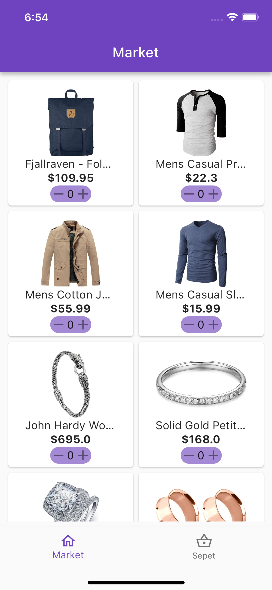
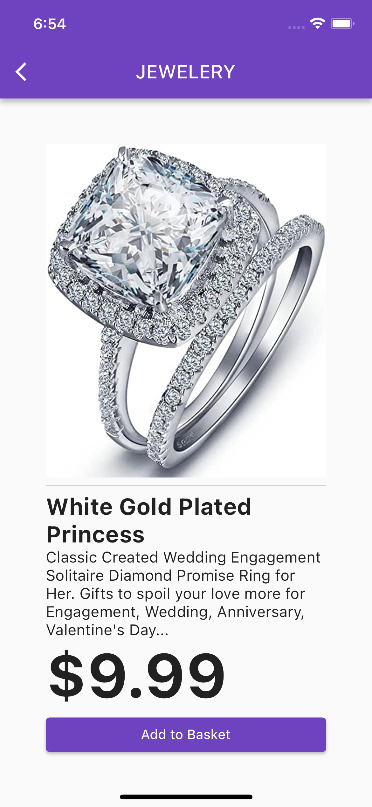
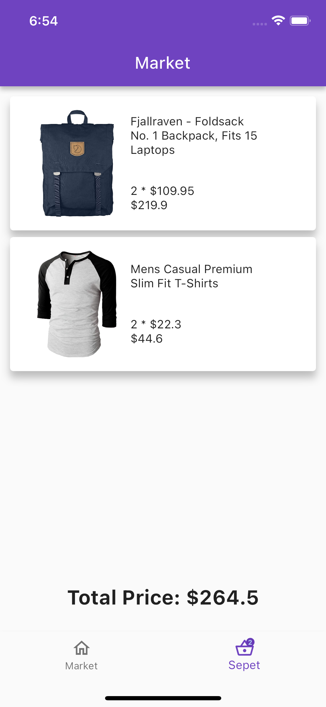

# Market App

Basit bir market uygulama senaryosu için hazırlanmış bir projedir.

## Özellikler

- **Ürün Görüntüleme:** Tüm ürünleri listeleyebilme.
- **Ürün Detay Görüntüleme:** Herhangi bir ürünün detaylarını görüntüleyebilme
- **Sepete Ekleme:** Ürünleri sepete ekleyebilme.
- **Sepetteki Ürünleri Gösterme:** Sepetteki tüm ürünleri listeleyebilme.
- **Benzersiz Ürün Sayısını Gösterme:** Sepetteki benzersiz ürünlerin sayısını gösterme.
- **Toplam Fiyat Tutarını Gösterme:** Sepetteki ürünlerin toplam fiyat tutarını gösterme.

## Kullanım

1. Uygulamayı indirin.
2. Gerekli paketleri yükleyin: `flutter pub get`
3. Uygulamayı başlatın: `flutter run`

## Kullanılan Teknolojiler

- **Provider**
- **Dio**

## Ekran Görüntüleri

  
  
  
  
  
  
  <!-- Buraya diğer ekran görüntüleri eklenir -->

